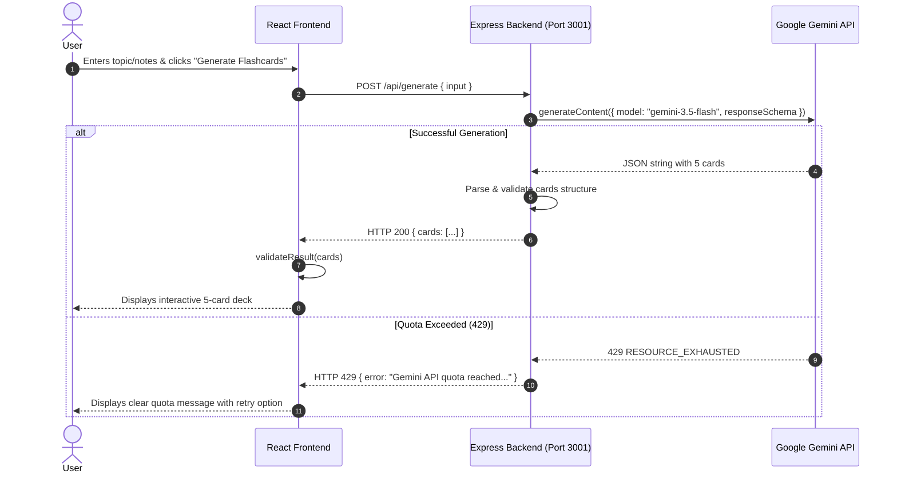

# AI Study Assistant — Interactive Flashcards

A full-stack React and Node.js application built for a Frontend Internship Assignment. It transforms user-provided study topics or raw notes into interactive, 5-card flashcard decks powered by Google's Gemini LLM.

---

## 🌟 Project Overview

The **AI Study Assistant** takes any free-form topic or lecture notes entered by the user and generates structured flashcards using Google's Gemini API. The response is validated on both the backend and frontend before being rendered into an interactive flashcard deck with flip animation, self-assessment tracking ("I Know" / "I Don't Know"), targeted retry for wrong cards, and deck restarting.

---

## ✨ Features

- **Free-form Text Input**: Accept up to 5,000 characters of study notes or topics.
- **Real Gemini LLM Integration**: Secure server-side call using `@google/genai` with `gemini-3.5-flash`.
- **Strict 5-Card Deck**: Guarantees exactly 5 cards per deck with structured JSON schema enforcement.
- **Interactive Flashcards**: Flip cards to toggle between question and answer with keyboard accessibility support (`Enter` / `Space`).
- **Self-Assessment & Rating**: Mark cards as "I Know" (✅) or "I Don't Know" (❌).
- **Retry Weak Cards**: Practice only cards previously marked as "I Don't Know".
- **Restart Deck**: Reset progress and practice the full deck again anytime.
- **Stale Request Protection**: Utilizes `useRef` request sequence tokens to ignore out-of-order API responses.
- **Comprehensive Error & Edge-Case Handling**: Gracefully handles network timeouts, malformed JSON, invalid structures, 429 quota exhaustion, and 503 service unavailability.
- **Responsive Mobile-First UI**: Optimized layouts for desktops, tablets, and mobile devices.

---

## 🛠️ Technology Stack

### Frontend
- **Framework**: React 19 (Functional Components & Hooks)
- **Build Tool**: Vite 7
- **Styling**: Vanilla CSS (Modular, responsive, custom variables)
- **Language**: JavaScript (ES2022+)

### Backend
- **Runtime**: Node.js
- **Server Framework**: Express 5
- **SDK**: `@google/genai` (Google Gen AI SDK v1.0)
- **Utilities**: `dotenv` for environment management, `cors` for cross-origin requests

---

## 📁 Project Structure

```text
flam-frontend-assignment/
├── server/
│   └── generate.js          # Express server with Gemini API integration & retry logic
├── src/
│   ├── assets/              # App static assets
│   ├── components/
│   │   ├── PromptInput.jsx   # Textarea form with character limit & validation
│   │   ├── ResultView.jsx    # Container component wrapping the flashcard deck
│   │   ├── FlashcardDeck.jsx # Interactive 5-card deck component (flip, score, retry)
│   │   ├── LoadingState.jsx  # Loading state indicator
│   │   └── ErrorState.jsx    # Error state display with retry button
│   ├── lib/
│   │   ├── api.js           # Client API service with AbortController timeout handling
│   │   └── validateResult.js# Client-side validation for AI response structure
│   ├── types/
│   │   └── result.js        # JSDoc type specifications for flashcard data
│   ├── App.jsx              # Main state container & orchestrator
│   ├── App.css              # Application layout & component styles
│   ├── index.css            # Global CSS reset
│   └── main.jsx             # React application entry point
├── .env                     # Environment variables (GEMINI_API_KEY - gitignored)
├── .gitignore               # Protects .env and node_modules from git commits
├── eslint.config.js         # ESLint flat configuration
├── package.json             # Project metadata, dependencies, and scripts
└── README.md                # Project documentation
```

---

## 🔄 How the Application Works



---

## 🤖 Gemini API Integration

1. **Security**: The `GEMINI_API_KEY` is loaded strictly on the backend using `dotenv`. It is **never exposed** in client-side bundles or HTTP requests.
2. **Structured Outputs**: Requests use Gemini's `responseMimeType: "application/json"` with a strict `responseSchema` enforcing a top-level `cards` array containing objects with string properties: `id`, `question`, and `answer`.
3. **503 Exponential Retry**: Temporary 503 errors trigger up to 5 retries with progressive backoff delays (3s, 6s, 9s...).
4. **429 Quota Handling**: Quota errors are caught immediately without futile retries, returning a human-readable 429 response to the frontend.

---

## 📄 Expected JSON Schema

```json
{
  "cards": [
    {
      "id": "1",
      "question": "What is React?",
      "answer": "React is a JavaScript library for building user interfaces."
    },
    {
      "id": "2",
      "question": "What is a component?",
      "answer": "A component is a reusable piece of UI."
    },
    {
      "id": "3",
      "question": "What is JSX?",
      "answer": "JSX allows JavaScript code to describe UI."
    },
    {
      "id": "4",
      "question": "What is state?",
      "answer": "State stores data that can change over time."
    },
    {
      "id": "5",
      "question": "What is a hook?",
      "answer": "A hook lets function components use React features."
    }
  ]
}
```

---

## 🛡️ Validation & Error Handling Strategy

1. **Input Validation**: Rejects empty or whitespace-only inputs before triggering network requests.
2. **Backend Validation**:
   - Parses returned AI text safely inside `try...catch`.
   - Ensures `data.cards` is an Array of **exactly 5 items**.
   - Validates that every card possesses non-empty `id`, `question`, and `answer` strings.
3. **Frontend Validation**:
   - `validateResult.js` re-verifies structural integrity before React sets application state.
   - Throws descriptive errors if any unexpected payload format is received.
4. **Race Condition Prevention**:
   - Uses `useRef(requestId)` to discard stale API responses if the user submits a new prompt before the previous request finishes.
5. **Timeout Management**:
   - Client requests use `AbortController` with a 20-second timeout to handle slow API responses gracefully.

---

## 🚀 Setup & Execution Instructions

### Prerequisites
- **Node.js**: v18.0.0 or higher
- **npm**: v9.0.0 or higher

### Step 1: Clone & Install Dependencies

```bash
cd flam-frontend-assignment
npm install
```

### Step 2: Configure Environment Variables

Create or update `.env` in the project root:

```env
GEMINI_API_KEY=your_actual_gemini_api_key_here
```

> ⚠️ **IMPORTANT**: Never commit `.env` or share your API key. `.gitignore` is configured to prevent `.env` from being tracked.

### Step 3: Start the Application

To run **both** the Express backend (Port 3001) and Vite frontend (Port 5173) simultaneously with a single command:

```bash
npm start
```

Alternatively, you can run server and client individually in separate terminals:

```bash
# Terminal 1: Backend Server
npm run server

# Terminal 2: Frontend Vite Client
npm run client
```

---

## 🧪 Verification & Testing Commands

```bash
# Run ESLint check
npm run lint

# Build production bundle
npm run build
```

---

## ⚠️ Known Limitations & API Notes

- **Gemini Free Tier Quota**: The free tier of `gemini-3.5-flash` limits requests to 20 per day per project. When exhausted, Gemini returns `429 RESOURCE_EXHAUSTED`. The app catches this and displays a clean error banner rather than crashing or showing raw error traces.
- **Exact Card Count**: The AI prompt and validation logic enforce strictly 5 flashcards per prompt generation.

---

## 📝 Implementation Notes

- **Time Spent**: ~4.5 hours (architecture setup, backend validation, frontend card state, accessibility & responsive polish).
- **AI Usage Disclosure**: Google Gemini API (`gemini-3.5-flash`) is used for generating flashcard content dynamically.
